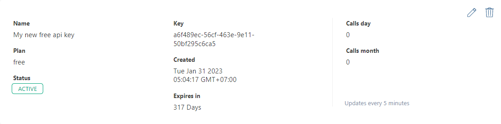

# Đăng ký API

> Đăng ký một số API để sử dụng trong bài học

## IQAir

Để sử dụng API của IQAir, cần đăng ký tài khoản tại [https://www.iqair.com/](https://www.iqair.com/) (nên sử dụng dịch vụ đăng ký bằng Gmail hoặc Facebook để đăng ký nhanh hơn). Sau khi đăng ký thành công, truy cập vào [Dashboard](https://www.iqair.com/dashboard) sau đó vào muc [API](https://www.iqair.com/dashboard/api) để lấy API Key.

:::note

Nếu chưa có API Key, chọn **NEW KEY** để tạo mới theo các bước sau:

1.  Chọn plan giống với plan lúc đăng ký tài khoản (thường là **_Community_**)
2.  Chọn **_CREATE_**

:::

:::info

-   Tài liệu: [https://api-docs.iqair.com/?version=latest](https://api-docs.iqair.com/?version=latest)

:::
