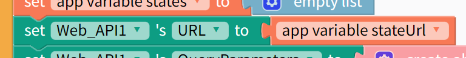
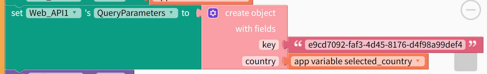

# Component Web API

> Component Web API có các block cho phép tương tác với API

:::danger

Web API là invisible component, không hiển thị trên màn hình

:::

| Thuộc tính      | Mô tả                                                                                           | Bắt buộc? |
| --------------- | ----------------------------------------------------------------------------------------------- | --------- |
| URL             | Url API                                                                                         | Có        |
| QueryParameters | Tham số để truyền dữ liệu                                                                       | Không     |
| Body            | Body của yêu cầu gọi API, chọn String hoặc Multipart Form Data                                  | Không     |
| Headers         | Header của yêu cầu gọi API, dùng để truyền thêm một số dữ liệu khác như username, password, ... | Không     |

## Ví dụ

-   Set `URL` cho component Web API
    

    ```
    https://pokeapi.co/api/v2/pokemon/ditto
    http://api.airvisual.com/v2/countries
    ```

-   Set `Query Parameters` cho component Web API
    

    Set 1 Object có các cặp key - value tương ứng với các params cần thiết (danh sách params đọc trong tài liệu của API)

    ```json
    {
        "key": ".........................",
        "country": "Vietnam"
    }
    ```

:::info

-   Tài liệu: [Web API Component](https://docs.thunkable.com/web-api)

:::
