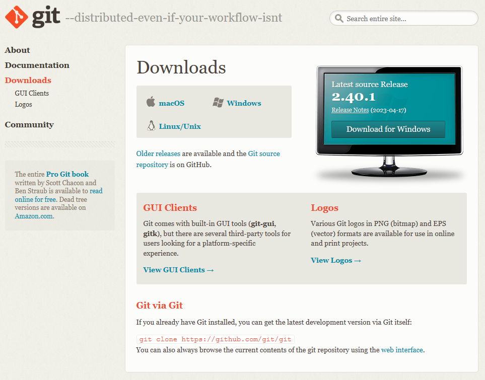

# Git và Github

## Git là gì

Git là một hệ thống quản lý phiên bản phân tán (Distributed Version Control System - DVCS) được phát triển bởi Linus Torvalds vào năm 2005. Git là một trong những hệ thống quản lý phiên bản phân tán phổ biến nhất hiện nay.

## Tại sao nên sử dụng Git

Git là một hệ thống quản lý phiên bản phân tán, nó có nhiều ưu điểm hơn so với hệ thống quản lý phiên bản tập trung (Centralized Version Control System - CVCS) như Subversion (SVN).

-   **Mỗi máy tính đều có một bản sao của toàn bộ kho mã nguồn**. Điều này có nghĩa là khi máy chủ chính bị hỏng, bạn có thể sử dụng bất kỳ bản sao nào để sao lưu lại dự án của mình.
-   **Các thao tác trên Git đều được thực hiện offline**. Điều này có nghĩa là bạn có thể làm việc mà không cần kết nối Internet. Sau khi bạn đã có một kho mã nguồn, bạn có thể làm việc trên đó mà không cần kết nối Internet.
-   **Các thao tác trên Git đều nhanh chóng**. Bạn có thể thực hiện các thao tác như commit, branch, merge, checkout, ... một cách nhanh chóng.
-   **Git có khả năng phân nhánh tốt**. Bạn có thể tạo nhiều nhánh để phát triển dự án mà không ảnh hưởng đến nhánh chính.
-   **Git có khả năng hợp nhất tốt**. Bạn có thể hợp nhất các nhánh lại với nhau một cách dễ dàng.
-   **Git có khả năng theo dõi lịch sử tốt**. Bạn có thể xem được lịch sử thay đổi của dự án.

## Cài đặt Git

Bạn có thể tải Git tại [https://git-scm.com/downloads](https://git-scm.com/downloads). Sau khi tải về phiên bản Git tương thích với hệ điều hành của mình, bạn có thể cài đặt Git bằng cách thực hiện các bước sau:

1. Tải về phiên bản Git tương thích với hệ điều hành
   

2. Mở file cài đặt và thực hiện các bước cài đặt (thường thì chỉ cần chọn `Next` liên tục)
   

3. Sau khi cài đặt xong Git, bạn có thể mở terminal<sup>[[1]](#terminal)</sup> và thực hiện lệnh `git --version` để kiểm tra phiên bản Git đã được cài đặt.
    ```bash
    git --version
    ```
    

## Cấu hình Git

Sau khi cài đặt Git, bạn cần mở terminal<sup>[[1]](#terminal)</sup> và cấu hình Git để có thể sử dụng được Git.

```bash
# Cấu hình tên người dùng
git config --global user.name "user-name"

# Cấu hình email
git config --global user.email "your_email@example.com"
```

## Các khái niệm cơ bản

:::info

-   **Local**: là môi trường trên máy tính cá nhân.
-   **Remote**: là môi trường trên máy chủ git (**Github**).

:::

1. **Repository (Kho mã nguồn)**: Kho mã nguồn là nơi lưu trữ toàn bộ lịch sử thay đổi của dự án. Kho mã nguồn có thể được lưu trữ trên máy chủ hoặc trên máy tính cá nhân.
2. **Clone (Sao chép)**: Clone là một bản sao của kho mã nguồn. Khi bạn muốn làm việc với một dự án, bạn có thể clone dự án đó về máy tính của mình và làm việc với dự án đó.
3. **Pull**: Pull là thao tác kéo các commit về máy tính. Khi bạn muốn lấy các commit mới nhất về máy tính, bạn có thể pull các commit đó về máy tính.
4. **Commit (Phiên bản)**: Mỗi lần thay đổi mã nguồn, bạn cần commit để lưu lại phiên bản hiện tại của mã nguồn. Mỗi commit sẽ có một mã hash duy nhất để phân biệt với các commit khác.
5. **Branch (Nhánh)**: Branch là một phiên bản của kho mã nguồn. Khi bạn muốn phát triển một tính năng mới, bạn có thể tạo một nhánh mới để phát triển tính năng đó mà không ảnh hưởng đến nhánh chính.
6. **Merge (Hợp nhất)**: Merge là thao tác hợp nhất các nhánh lại với nhau. Khi bạn đã hoàn thành tính năng mới, bạn có thể hợp nhất nhánh đó vào nhánh chính.
7. **Pull request (Yêu cầu hợp nhất)**: Pull request là một yêu cầu hợp nhất các nhánh lại với nhau. Khi bạn đã hoàn thành tính năng mới, bạn có thể tạo một pull request để yêu cầu hợp nhất nhánh đó vào nhánh chính.
8. **Fork (Nhân bản)**: Fork là một bản sao của kho mã nguồn. Khi bạn muốn đóng góp vào một dự án, bạn có thể fork dự án đó về tài khoản của mình và đóng góp vào dự án đó.

<!--  -->

## Các thao tác

### Init

Thực hiện lệnh `git init` để khởi tạo một repo mới.

```bash
git init
```

> Tham khảo https://git-scm.com/docs/git-init

### Clone

Thực hiện lệnh `git clone <url>` để clone một repo vào một folder (thường sẽ tạo một folder cùng tên với repo) trên local. Quá trình clone sẽ khởi tạo remote `origin` trỏ tới repo trên Github. Việc clone thường được thực hiện khi bạn muốn làm việc với một repo đã tồn tại trên remote và chỉ làm một lần duy nhất.

```bash
git clone <url>
```

> Tham khảo https://git-scm.com/docs/git-clone

### Add

Thực hiện lệnh `git add <file>` để thêm file vào staging area. Các chỉnh sửa/thêm mới không tự được thêm vào staging area mà phải thực hiện lệnh `add`.

```bash
git add <file1> <file2> # Thêm file cụ thể vào staging area
git add -A              # Thêm tất cả thay đổi vào staging area
git add .               # [Hay dùng nhất] Thêm file mới, file thay đổi (không bao gồm file bị xóa) vào staging area
git add -u              # Thêm file thay đổi, file bị xóa (không bao gồm file mới) vào staging area
```

> Tham khảo https://git-scm.com/docs/git-add

### Commit

Thực hiện lệnh `git commit -m "<message>"` để commit các file trong staging area, lưu lại sự thay đổi ở phía local.

```bash
git commit -m "<message>"
```

:::info
`<message>` là nội dung commit, thường là mô tả về sự thay đổi của các phần code trong commit, ví dụ: **git commit -m "Fix bug #123"**. Message thường ngắn gọn, không quá 50 ký tự, nên viết bằng tiếng Anh và không có dấu câu ở cuối.
:::

> Tham khảo https://git-scm.com/docs/git-commit

### Push

Thực hiện lệnh `git push origin <branch>` để đẩy các commit từ local lên remote.

```bash
git push origin <branch> # nên chỉ rõ branch
```

:::warning Popup đăng nhập khi push lần đầu tiên
Trên Windows khi push lần đâu tiên sẽ có cửa sổ đăng nhập hiện ra, bạn cần nhập username và password của Github để đăng nhập.
:::

> Tham khảo https://git-scm.com/docs/git-push

### Pull

Thực hiện lệnh `git pull origin <branch>` để kéo các commit về máy tính. Thao tác này nên được thực hiện trước khi bắt đầu làm việc để đảm bảo bạn đang làm việc trên phiên bản mới nhất, tránh trường hợp bị conflict.

```bash
git pull origin <branch> # nên chỉ rõ branch
```

> Tham khảo https://git-scm.com/docs/git-pull

<!-- ### Branch

```bash
git branch <branch>: Tạo một nhánh mới
git branch: Liệt kê các nhánh hiện tại
git branch -d <branch>: Xóa một nhánh
```

Thực hiện lệnh `git branch <branch>` để tạo một nhánh mới.

### Checkout

```bash
git checkout <branch>: Chuyển sang một nhánh khác
git checkout -b <branch>: Tạo một nhánh mới và chuyển sang nhánh mới
```

Thực hiện lệnh `git checkout <branch>` để chuyển sang một nhánh khác.

### Merge

```bash
git merge <branch>: Hợp nhất một nhánh vào nhánh hiện tại
```

Thực hiện lệnh `git merge <branch>` để hợp nhất một nhánh vào nhánh hiện tại.

### Pull request

```bash
git pull-request: Tạo một pull request
```

Thực hiện lệnh `git pull-request` để tạo một pull request.

### Fetch

```bash
git fetch: Lấy các commit mới nhất về máy tính
```

Thực hiện lệnh `git fetch` để lấy các commit mới nhất về máy tính.

### Rebase

```bash
git rebase <branch>: Hợp nhất các commit của nhánh hiện tại vào nhánh khác
```

Thực hiện lệnh `git rebase <branch>` để hợp nhất các commit của nhánh hiện tại vào nhánh khác.

### Reset

```bash
git reset <commit>: Quay lại một commit trước đó
```

Thực hiện lệnh `git reset <commit>` để quay lại một commit trước đó.

### Revert

```bash
git revert <commit>: Tạo một commit mới để quay lại một commit trước đó
```

Thực hiện lệnh `git revert <commit>` để tạo một commit mới để quay lại một commit trước đó. -->

## Github

Github là một dịch vụ lưu trữ mã nguồn trực tuyến. Github cung cấp các tính năng như quản lý phiên bản, theo dõi lịch sử thay đổi, hợp nhất các nhánh, ... Github cũng cung cấp các tính năng như quản lý issue, pull request, project, ... Github cũng cung cấp các tính năng như quản lý issue, pull request, project, ...

### Tạo một repo mới

Bạn có thể tạo một repo mới trên Github bằng cách thực hiện các bước sau:

1.  Đăng nhập vào Github.
2.  Nhấn vào nút `New` để tạo một repo mới.
3.  Đặt tên cho repo.
4.  Chọn `Public` hoặc `Private`.
5.  Có thể chọn `Initialize this repository with a README` để tạo sẵn file README.
6.  Nhấn vào nút `Create repository`.

### Clone một repo

Bạn có thể clone một repo từ remote (Github) về local bằng cách thực hiện các bước sau:

1.  Đăng nhập vào Github.
2.  Nhấn vào repo cần clone.
3.  Nhấn vào nút `Code`.
4.  Chọn `HTTPS` hoặc `SSH`.
5.  Copy đường dẫn.
6.  Mở terminal và thực hiện lệnh `git clone <url>`.
7.  Nhập username và password (thường chỉ có lần đầu tiên sau khi mới cài Git là phải nhập).

:::info
Các thao tác trên là thực hiện trên **Windows**, trên **MacOS** và **Linux** sẽ có một số khác biệt nhỏ (phần này nâng cao hơn, bàn sau).
:::

## Quy trình làm việc cơ bản

### Tạo repo

:::info
Phần này có 2 trường hợp:

-   Tạo repo trên Github và clone về local. **(cách này thường được sử dụng nhiều hơn khi bắt đầu làm từ đầu)**
-   Tạo repo trên local và đẩy lên Github. **(cách này thường được sử dụng khi đã có một dự án trên local và muốn đẩy lên Github)**

Dù là trường hợp nào thì vẫn cần có repo trên remote và repo trên local sau đó tạo remote `origin` (bên dưới sẽ hướng dẫn cách tạo) để liên kết với nhau
:::

#### Tạo repo mới trên Github và clone về local.

1.  Tạo repo mới trên Github theo [hướng dẫn bên trên](#tạo-một-repo-mới)
2.  Sau khi tạo xong copy đường dẫn repo (có thể ấn nút copy ở phía bên phải hoặc tự copy đường dẫn)
    
3.  Mở terminal và thực hiện lệnh `git clone <url>` để clone repo về local
    ```bash
    git clone <your_git_repo_url>
    ```
    
4.  Sau khi clone xong, sử dụng VSCode mở folder repo vừa clone về và thực hiện lệnh `git remote -v` để kiểm tra remote trỏ tới repo trên Github
    ```bash
    git remote -v
    ```
    

Bạn có thể thực hiện các bước sau để làm việc với một repo:

1.  Clone repo về local (chỉ làm 1 lần duy nhất).

    ```bash
    git clone <url>
    ```

2.  Pull code từ nhánh đang làm việc về.

    ```bash
    git pull origin <branch>
    ```

3.  Thực hiện các thao tác thêm, sửa, xóa file.
4.  Thực hiện lệnh `git add <file>` để thêm file vào staging area.

    ```bash
    git add <file>
    git add . # (thêm nhanh tất cả các file)
    ```

5.  Thực hiện lệnh `git commit -m "<message>"` để commit các file trong staging area.

    ```bash
    git commit -m "<message>"
    ```

6.  Thực hiện lệnh `git push origin <branch>` để đẩy các commit lên remote.

    ```bash
    git push origin <branch>
    ```

:::tip
Trên đây là quy trình làm việc cơ bản trên 1 branch, nếu có nhiều branch thì sẽ cần có thêm các thao tác merge, rebase, pull request, ...
:::

## Github Desktop

Github Desktop là một ứng dụng giúp bạn làm việc với Github trên máy tính một cách dễ dàng. Bạn có thể tải Github Desktop tại [https://desktop.github.com/](https://desktop.github.com/).

### Cài đặt Github Desktop

Sau khi tải Github Desktop về, bạn có thể cài đặt Github Desktop bằng cách thực hiện các bước sau:

1.  Mở file cài đặt.
2.  Nhấn vào nút `Install`.
3.  Nhấn vào nút `Sign in with your browser`.
4.  Đăng nhập vào Github.
5.  Nhấn vào nút `Authorize Github Desktop`.
6.  Nhấn vào nút `Continue`.
7.  Nhấn vào nút `Install`.
8.  Nhấn vào nút `Finish`.

### Cấu hình Github Desktop

Sau khi cài đặt Github Desktop, bạn cần cấu hình Github Desktop để có thể sử dụng được Github Desktop.

1.  Mở Github Desktop.
2.  Nhấn vào nút `Sign in with your browser`.
3.  Đăng nhập vào Github.
4.  Nhấn vào nút `Authorize Github Desktop`.
5.  Nhấn vào nút `Continue`.
6.  Nhấn vào nút `Install`.
7.  Nhấn vào nút `Finish`.

### Tạo một repo mới

Bạn có thể tạo một repo mới bằng cách thực hiện các bước sau:

1.  Mở Github Desktop.
2.  Nhấn vào nút `Create a New Repository on your hard drive`.
3.  Đặt tên cho repo.
4.  Chọn đường dẫn lưu trữ repo.
5.  Nhấn vào nút `Create Repository`.

### Clone một repo

Bạn có thể clone một repo bằng cách thực hiện các bước sau:

1.  Mở Github Desktop.
2.  Nhấn vào nút `Add`.
3.  Chọn `Clone`.
4.  Chọn repo cần clone.
5.  Chọn đường dẫn lưu trữ repo.
6.  Nhấn vào nút `Clone`.

### Quy trình làm việc cơ bản

Các thao tác trong Github Desktop đều thực hiện trên GUI rất rõ ràng, quy trình làm việc không khác gì so với sử dụng CLI.

## Chú thích

### Terminal

:::info
Terminal ở đấy là để chỉ một môi trường dòng lệnh, ví dụ như **Command Prompt, Powershell** trên Windows, **Terminal** trên MacOS, Linux ...
:::
