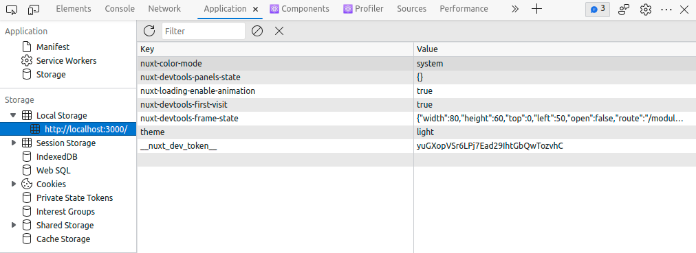

# Local Storage

> **Local Storage** là một cơ chế lưu trữ dữ liệu trên trình duyệt. Nó cho phép lưu trữ dữ liệu dưới dạng các key-value, và dữ liệu này sẽ được lưu trữ trên trình duyệt của người dùng ngay cả khi họ tắt trình duyệt đi và mở lại.

Local Storage có thể được xem trực tiếp thông qua DevTools của trình duyệt. Bằng cách mở DevTools và chuyển đến tab `Application`, ta có thể thấy được các dữ liệu đang được lưu trữ trong Local Storage.



:::caution
Local Storage lưu dữ liệu theo domain (tên miền) của trang web. Ví dụ, nếu bạn lưu trữ dữ liệu vào Local Storage của trang `https://example.com`, thì dữ liệu đó sẽ chỉ có thể được truy cập từ trang `https://example.com` và không thể được truy cập từ trang `https://example.org`.
:::

## Key - Value

**Local Storage** lưu trữ dữ liệu dưới dạng các key-value. Mỗi key sẽ tương ứng với một value. Ví dụ:

```js
localStorage.setItem("name", "John");
```

Trong đoạn code trên, `name` là key, `John` là value.

Hoặc trong hình minh họa trên, ta có một số cặp key-value như sau:

- `nuxt-color-mode` là key, `system` là value
- `theme` là key, `light` là value
- ...

## Các kiểu dữ liệu được lưu trữ

**Local Storage** chỉ có thể lưu trữ các kiểu dữ liệu sau:

- `string`
- `number`
- `boolean`
- `object`
- `array`

Tuy nhiên khi lưu trữ các kiểu dữ liệu này, chúng đều sẽ được chuyển đổi thành kiểu `string` trước khi lưu trữ. Và khi lấy dữ liệu từ Local Storage ra, chúng sẽ là kiểu `string` và **cần được chuyển đổi về kiểu dữ liệu ban đầu** để dễ dàng thao tác hơn.

## Các phương thức của Local Storage

**Local Storage** có thể được sử dụng thông qua object `localStorage` của trình duyệt. Object này có các phương thức sau:

### `setItem(key, value)`

Sử dụng phương thức `setItem()` để lưu trữ dữ liệu vào **Local Storage**. Phương thức này nhận vào 2 tham số:

- `key`: tên của dữ liệu cần lưu trữ.
- `value`: giá trị của dữ liệu cần lưu trữ.

Ví dụ:

```js
localStorage.setItem("name", "John");
```

### `getItem(key)`

Sử dụng phương thức `getItem()` để lấy dữ liệu từ **Local Storage**. Phương thức này nhận vào 1 tham số:

- `key`: tên của dữ liệu cần lấy.

Ví dụ:

```js
const name = localStorage.getItem("name");
```

### `removeItem(key)`

Sử dụng phương thức `removeItem()` để xóa dữ liệu từ **Local Storage**. Phương thức này nhận vào 1 tham số:

- `key`: tên của dữ liệu cần xóa.

Ví dụ:

```js
localStorage.removeItem("name");
```

### `clear()`

Sử dụng phương thức `clear()` để xóa toàn bộ dữ liệu từ **Local Storage**.

Ví dụ:

```js
localStorage.clear();
```

## Ví dụ

### Lưu trữ dữ liệu

```js
localStorage.setItem("name", "John");
localStorage.setItem("age", 20);
localStorage.setItem("isMale", true);
localStorage.setItem("hobbies", JSON.stringify(["reading", "coding"]));
localStorage.setItem(
  "address",
  JSON.stringify({ city: "Hanoi", country: "Vietnam" })
);
```

### Lấy dữ liệu

```js
const name = localStorage.getItem("name");
const age = localStorage.getItem("age");
const isMale = localStorage.getItem("isMale");
const hobbies = JSON.parse(localStorage.getItem("hobbies"));
const address = JSON.parse(localStorage.getItem("address"));
```

## JSON

Ở trong ví dụ trên, có 2 điểm đặc biệt

- Dữ liệu `hobbies` và `address` cần được thể hiện dưới dạng `array` và `object`, nhưng Local Storage chỉ có thể lưu trữ dữ liệu dạng `string`. Do đó ta cần chuyển đổi dữ liệu sang dạng `string` trước khi lưu trữ. Để làm được thao tác này ta cần hàm `JSON.stringify()`.

```js
const hobbies = JSON.stringify(["reading", "coding"]);
const address = JSON.stringify({ city: "Hanoi", country: "Vietnam" });

console.log(hobbies); // '["reading","coding"]'
console.log(address); // '{"city":"Hanoi","country":"Vietnam"}'
```

- Khi lấy dữ liệu từ Local Storage ra, dữ liệu sẽ là dạng `string` và ta cần chuyển đổi dữ liệu về dạng ban đầu để dễ dàng thao tác hơn. Để làm được thao tác này ta cần hàm `JSON.parse()`.

```js
const hobbies = JSON.parse(localStorage.getItem("hobbies"));
const address = JSON.parse(localStorage.getItem("address"));

console.log(hobbies); // ['reading', 'coding']
console.log(address); // { city: 'Hanoi', country: 'Vietnam' }
```
