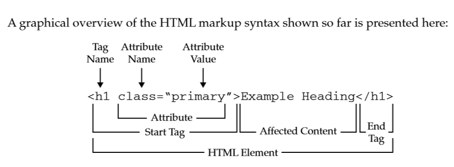

# HTML

## HTML là gì

HTML là viết tắt của HyperText Markup Language. Đây là ngôn ngữ đánh dấu siêu văn bản được sử dụng để tạo các trang web. Nó mô tả cấu trúc của một trang web và được sử dụng để tạo các trang web động.

## Cấu trúc thẻ HTML



Một thẻ HTML bao gồm thẻ mở và thẻ đóng. Thẻ mở bắt đầu bằng dấu nhỏ hơn `<` và kết thúc bằng dấu lớn hơn `>`. Thẻ đóng bắt đầu bằng dấu nhỏ hơn `<`, theo sau là dấu gạch chéo `/` và kết thúc bằng dấu lớn hơn `>`. Một số trường hợp sẽ không có thẻ đóng.

> Các thẻ HTML có thể lồng vào nhau để tạo thành cấu trúc phân cấp. Thẻ nằm bên trong được gọi là thẻ con, thẻ bên ngoài được gọi là thẻ cha.

```html
<!-- Thẻ cha -->
<tagname attr="...">
    <!-- Thẻ con -->
    <tagname attr="..."></tagname>
    <!-- Trường hợp đặc biệt không có thẻ đóng -->
    <tagname attr="..." />
</tagname>
```

## Cấu trúc 1 trang HTML cơ bản

```html
<!-- Khai báo doctype, doctype cho trình duyệt biết trang được viết bằng phiên bản HTML nào. -->
<!DOCTYPE html>
<!-- Thuộc tính `lang` bên trong thẻ mở `<html>` đặt ngôn ngữ cho trang. Screen reader cũng sẽ dựa vào thuộc tính này để đọc và phát âm đúng cách -->
<html lang="en">
    <!-- Bên trong các thẻ `<head>`, chứa các metadata là dữ liệu mô tả cho trang web. -->
    <head>
        <!-- `UTF-8` là mã hóa ký tự tiêu chuẩn nên sử dụng trong trang web. Đây thường sẽ là thẻ `<meta>` đầu tiên được hiển thị trong thẻ `<head>`. -->
        <meta charset="UTF-8" />
        <!-- Thẻ `<meta>` dưới chỉ định document mode cho Internet Explorer. `IE=edge` là chế độ được hỗ trợ cao nhất. -->
        <meta http-equiv="X-UA-Compatible" content="IE=edge" />
        <!-- `viewport` khai báo chiều rộng của trang thành chiều rộng của kích thước màn hình của thiết bị. Nếu thiết bị di động rộng 600px thì cửa sổ trình duyệt cũng sẽ rộng 600px. `initial-scale` kiểm soát mức zoom của trang. Giá trị 1 cho `initial-scale` ngăn trình duyệt tự zoom. -->
        <meta name="viewport" content="width=device-width, initial-scale=1.0" />
        <!-- Thẻ `<title>` là tiêu đề cho trang web. Văn bản này được hiển thị trên thanh tiêu đề của trình duyệt. -->
        <title>...</title>
        <!-- `rel="shortcut icon" đánh dấu icon cho trang web, icon này hiển thị cạnh tiêu đề trang trên thanh tiêu đề của trình duyệt` -->
        <link rel="shortcut icon" href="..." type="image/x-icon" />
    </head>
    <body></body>
</html>
```

## Một số thẻ HTML thường dùng

```mdx-code-block
import {HTMLTagPreview} from '@site/src/components/HTMLTagPreview';

<HTMLTagPreview />
```
