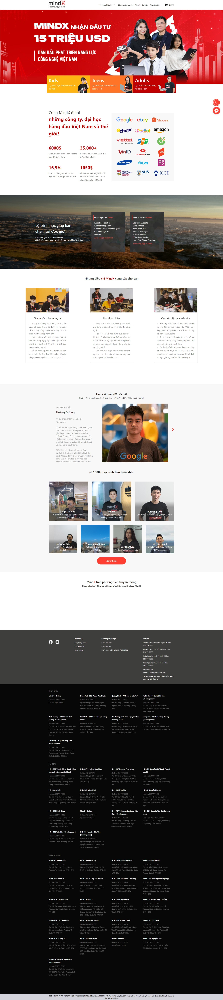

## Giới thiệu

Xây dựng trang landing page dựa theo giao diện trên trang [Mindx](https://mindx.edu.vn/)

:::info
Project này tương đương với một sản phẩm ở mức tốt của **Web Basic**
:::

<!-- truncate -->



## Chuẩn bị

### Cấu trúc thư mục

```bash
mindx-landing-page-clone
├── images
│   ├── logo.png
│   └── ...
├── index.html
├── index.css
└── index.js
```

### File `index.html`

Chuẩn bị sẵn phần khung HTML cơ bản và sử dụng comment để đánh dấu một số phần như dưới đây.

Mỗi phần trên trang như Navbar, Header, ... sẽ nằm trong 1 `<section>` với id tương ứng.

```html
<!-- Khai báo doctype, doctype cho trình duyệt biết trang được viết bằng phiên bản HTML nào. -->
<!DOCTYPE html>
<!-- Thuộc tính `lang` bên trong thẻ mở `<html>` đặt ngôn ngữ cho trang. Screen reader cũng sẽ dựa vào thuộc tính này để đọc và phát âm đúng cách -->
<html lang="en">
  <!-- Bên trong các thẻ `<head>`, chứa các metadata là dữ liệu mô tả cho trang web. -->
  <head>
    <!-- `UTF-8` là mã hóa ký tự tiêu chuẩn nên sử dụng trong trang web. Đây thường sẽ là thẻ `<meta>` đầu tiên được hiển thị trong thẻ `<head>`. -->
    <meta charset="UTF-8" />
    <!-- Thẻ `<meta>` dưới chỉ định document mode cho Internet Explorer. `IE=edge` là chế độ được hỗ trợ cao nhất. -->
    <meta http-equiv="X-UA-Compatible" content="IE=edge" />
    <!-- `viewport` khai báo chiều rộng của trang thành chiều rộng của kích thước màn hình của thiết bị. Nếu thiết bị di động rộng 600px thì cửa sổ trình duyệt cũng sẽ rộng 600px. `initial-scale` kiểm soát mức zoom của trang. Giá trị 1 cho `initial-scale` ngăn trình duyệt tự zoom. -->
    <meta name="viewport" content="width=device-width, initial-scale=1.0" />
    <!-- Thẻ `<title>` là tiêu đề cho trang web. Văn bản này được hiển thị trên thanh tiêu đề của trình duyệt. -->
    <title>Trường học công nghệ MindX</title>
    <!-- `rel="shortcut icon" đánh dấu icon cho trang web, icon này hiển thị cạnh tiêu đề trang trên thanh tiêu đề của trình duyệt` -->
    <link rel="shortcut icon" href="https://mindx.edu.vn/static/images/favicon.png" type="image/x-icon" />

    <!-- Styles -->
    <!-- Thẻ `<link>` dưới đây sẽ liên kết CSS với trang HTML. `rel="stylesheet"` xác định mối quan hệ giữa tệp HTML và external stylesheet. -->
    <link rel="stylesheet" href="./index.css" />
  </head>
  <body>
    <!-- Navbar -->
    <section id="navbar">...</section>

    <!-- Header (banner) -->
    <section id="header">...</section>

    <!-- Intro -->
    <section id="intro">...</section>

    <!-- Benefit (facts + companies) -->
    <section id="benefit">...</section>

    <!-- Courses -->
    <section id="courses">...</section>

    <!-- Selling points -->
    <section id="selling-points">...</section>

    <!-- Honored students -->
    <section id="honored">...</section>

    <!-- Media appearances -->
    <section id="media">...</section>

    <!-- Events -->
    <section id="events">...</section>

    <!-- Footer -->
    <section id="footer">...</section>

    <!-- Scripts -->
    <!-- Các thẻ <script> bên ngoài sẽ được đặt ngay trước thẻ </body> kết thúc. Đây là nơi liên kết mã JavaScript bên ngoài vào trang. -->
    <script src="./index.js"></script>
  </body>
</html>
```

### File `index.css`

Như mọi project khác, luôn luôn phải reset lại style mặc định của trình duyệt. Trên trang đã có bài hướng dẫn về [**CSS Reset**](./../css-reset.md). Ngoài ra ở `body` cũng chỉnh thêm một chút về **font chữ**, **cỡ chữ** và **màu chữ**

```css
/* Box sizing rules */
*,
*::before,
*::after {
  box-sizing: border-box;
}

/* Remove default margin */
body,
h1,
h2,
h3,
h4,
p,
figure,
blockquote,
dl,
dd {
  margin: 0;
}

/* Remove list styles on ul, ol elements with a list role, which suggests default styling will be removed */
ul[role="list"],
ol[role="list"] {
  list-style: none;
}

ul,
ol {
  padding: 0;
  margin: 0;
}

/* Set core root defaults */
html:focus-within {
  scroll-behavior: smooth;
}

/* Set core body defaults */
body {
  min-height: 100vh;
  text-rendering: optimizeSpeed;
  line-height: 1.5;
  font-family: -apple-system, BlinkMacSystemFont, Segoe UI, PingFang SC, Hiragino Sans GB, Microsoft YaHei, Helvetica Neue, Helvetica, Arial, sans-serif,
    Apple Color Emoji, Segoe UI Emoji, Segoe UI Symbol;
  font-size: 14px;
  color: rgba(0, 0, 0, 0.65);
}

/* A elements that don't have a class get default styles */
a:not([class]) {
  text-decoration-skip-ink: auto;
}

/* Remove underline */
a {
  text-decoration: none;
}

/* Make images easier to work with */
img,
picture {
  max-width: 100%;
  display: block;
}

/* Inherit fonts for inputs and buttons */
input,
button,
textarea,
select {
  font: inherit;
}

/* Remove all animations, transitions and smooth scroll for people that prefer not to see them */
@media (prefers-reduced-motion: reduce) {
  html:focus-within {
    scroll-behavior: auto;
  }

  *,
  *::before,
  *::after {
    animation-duration: 0.01ms !important;
    animation-iteration-count: 1 !important;
    transition-duration: 0.01ms !important;
    scroll-behavior: auto !important;
  }
}
```

## Quá trình hoàn thiện

[Phần 1: Giới thiệu](./part-1.md)

[Phần 2: Navbar](./part-2.md)
