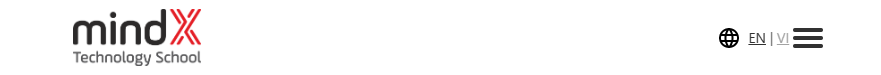
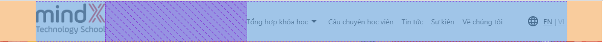

## Xây dựng phần Navbar đầu trang

<!-- truncate -->

### Xem trước

-   Desktop

    

-   Mobile (nâng cao)

    

### Bố cục

Navbar này bao gồm 2 phần chính

-   Logo
-   Menu và ngôn ngữ

> 2 phần này nằm trên **1 hàng ngang và ở 2 phía** của navbar => **2 phần này nắm trong 1 flexbox có `justify-content: space-between`**

Sau khi xác định được bố cục chính, ta sẽ bắt đầu xây dựng các phần theo trình tự dưới đây

### Chi tiết

#### Khung HTML

```html
<!-- Navbar -->
<section id="navbar">
    <nav>
        <div class="navbar-container">
            <!-- Logo -->
            <a class="navbar-logo" href="/">
                
            </a>

            <!-- Menu và ngôn ngữ -->
            <div class="navbar-menu-lang">
                <!-- Menu -->
                <ul class="navbar-menu">
                    <li class="navbar-menu-item">
                        <a href="#">Tổng hợp khóa học</a>
                    </li>
                    <li class="navbar-menu-item">
                        <a href="#">Câu chuyện học viên</a>
                    </li>
                    <li class="navbar-menu-item">
                        <a href="#">Tin tức</a>
                    </li>
                    <li class="navbar-menu-item">
                        <a href="#">Sự kiện</a>
                    </li>
                    <li class="navbar-menu-item">
                        <a href="#">Về chúng tôi</a>
                    </li>
                </ul>

                <!-- Ngôn ngữ -->
                <div class="navbar-lang">
                    <svg xmlns="http://www.w3.org/2000/svg" height="24px" viewBox="0 0 24 24" width="24px" fill="#000000">
                        <path d="M0 0h24v24H0z" fill="none"></path>
                        <path
                            d="M11.99 2C6.47 2 2 6.48 2 12s4.47 10 9.99 10C17.52 22 22 17.52 22 12S17.52 2 11.99 2zm6.93 6h-2.95c-.32-1.25-.78-2.45-1.38-3.56 1.84.63 3.37 1.91 4.33 3.56zM12 4.04c.83 1.2 1.48 2.53 1.91 3.96h-3.82c.43-1.43 1.08-2.76 1.91-3.96zM4.26 14C4.1 13.36 4 12.69 4 12s.1-1.36.26-2h3.38c-.08.66-.14 1.32-.14 2 0 .68.06 1.34.14 2H4.26zm.82 2h2.95c.32 1.25.78 2.45 1.38 3.56-1.84-.63-3.37-1.9-4.33-3.56zm2.95-8H5.08c.96-1.66 2.49-2.93 4.33-3.56C8.81 5.55 8.35 6.75 8.03 8zM12 19.96c-.83-1.2-1.48-2.53-1.91-3.96h3.82c-.43 1.43-1.08 2.76-1.91 3.96zM14.34 14H9.66c-.09-.66-.16-1.32-.16-2 0-.68.07-1.35.16-2h4.68c.09.65.16 1.32.16 2 0 .68-.07 1.34-.16 2zm.25 5.56c.6-1.11 1.06-2.31 1.38-3.56h2.95c-.96 1.65-2.49 2.93-4.33 3.56zM16.36 14c.08-.66.14-1.32.14-2 0-.68-.06-1.34-.14-2h3.38c.16.64.26 1.31.26 2s-.1 1.36-.26 2h-3.38z"
                        ></path>
                    </svg>

                    <a href="#">EN</a>
                    |
                    <a href="#">VI</a>
                </div>
            </div>
        </div>
    </nav>
</section>
```

-   Sử dụng thẻ `<nav>` để đánh dấu phần navbar của trang (có thể tìm kiếm **_semantic improvement in HTML_** để hiểu lý do tại sao lại dùng thẻ này)
-   `<nav>` là thẻ block, vì vậy chiều ngang luôn tự chiếm 100% thẻ cha của nó là `<section>` hiện đang tương đương với 100% chiều ngang màn hình, vì thế ta cần 1 `<div class="navbar-container">` để giới hạn khoảng không gian hiển thị bên trong `<nav>` lại. Dựa vào hình minh họa dưới đây có thể thấy logo và menu đều cách viền màn hình 1 khoảng trắng khá xa, chứng tỏ phần nội dung không hề chiếm toàn bộ chiều ngang của `<nav>`
    
-   Trong container ta sẽ chia 2 phần như đã nêu ra trong bố cục `<a class="navbar-logo" href="/">` và `<div class="navbar-menu-lang">`. Phần logo thì khá đơn giản ta chỉ cần sử dụng 1 thẻ `<a>` là đủ, còn phần menu và ngôn ngữ có khá nhiều chi tiết bên trong nên ta sẽ sử dụng `<div>`
-   Trong phần logo, ta thêm 1 thẻ `` để hiển thị ảnh logo là xong
-   Trong phần menu và ngôn ngữ, phải tiếp tục chia làm 2 phần là chọn menu `<ul class="navbar-menu">` và chọn ngôn ngữ `<div class="navbar-lang">`. Chúng ta hoàn toàn có thể không chia 2 phần, viết tất cả mọi thành phần con bên trong `<div class="navbar-menu-lang">` nhưng nên chia ra để code rõ ràng, dể hiểu và dễ bảo trì, responsive
-   Trong phần menu, ta sử dụng danh sách để tạo 5 menu item tương ứng
-   Trong phần chọn ngôn ngữ thì đơn giản 2, sử dụng 2 thẻ `<a>` là được

#### CSS

Tạo comment `/* Navbar */` để đánh dấu phần navbar trong `index.css` và bắt đầu style cho phần header

-   Style một chút cho thẻ `<nav>` để định hình phần navbar

    ```css
    nav {
        width: 100%;
        /* Navbar luôn ở trên đầu trang nên ta sử dụng fixed */
        position: fixed;
        /* Khai báo top = 0 để navbar luôn ở cạnh trên của màn hình */
        top: 0;
        z-index: 10;
        background-color: #fff;
        /* Thêm một chút đổ bóng */
        box-shadow: 0 0 0.25rem 0 rgba(0, 0, 0, 0.08), 0 0.25rem 0.25rem 0 rgba(0, 0, 0, 0.08);
    }
    ```

-   Phần `navbar-container` thì liên quan khá nhiều đến responsive, nhưng tạm thời ta cứ mặc định là đang làm giao diện desktop. Container này cũng chứa 2 phần chính là Logo + menu nên như đã đề ra ở phần [bố cục](#bố-cục), đây sẽ là 1 flexbox

    ```css
    .navbar-container {
        height: 4.75rem;
        display: flex;
        /* Cần có thểm align-item: center để ảnh và menu cân bằng nhau theo chiều dọc của nav */
        align-items: center;
        justify-content: space-between;

        /* Container chỉ chiếm 80% chiều ngang của nav thôi */
        width: 80%;
        /* Sử dụng combo margin left và right bằng auto để đưa container vào giữa nav */
        margin-left: auto;
        margin-right: auto;
    }
    ```

-   Phần logo tạm thời chỉ cần style cho ảnh bé lại là được

    ```css
    .navbar-logo > img {
        height: 3rem;
    }
    ```

-   Menu và ngôn ngữ nằm ngang hàng với nhau nên ta sử dụng flexbox cho element chứa 2 phần này

    ```css
    .navbar-menu-lang {
        display: flex;
        align-items: center;
        /* Thêm một chút khoảng cách giữa các item */
        gap: 3rem;
    }
    ```

-   Phần menu tương tự vậy, ta cũng có thể thấy tất cả các item bên trong đều thằng hàng trên 1 hàng ngang

    ```css
    .navbar-menu {
        display: flex;
        align-items: center;
        /* Thêm một chút khoảng cách giữa các item */
        gap: 1.25rem;
        /* Xóa bỏ dấu chấm ở đầu mỗi item trong danh sách */
        list-style: none;
    }
    ```

-   Đối với từng item trong menu, ta đổi màu chữ và xóa bỏ dấu gạch dưới của thẻ `<a>` và thêm một chút hiệu ứng đổi màu khi hover là được

    ```css
    .navbar-menu-item a {
        color: #313131;
        transition: color 0.3s;
    }

    .navbar-menu-item a:hover {
        color: #000000;
    }
    ```

-   Các element trong phần chọn ngôn ngữ chưa thẳng hàng với nhau theo hàng ngang, ta sẽ dùng flexbox + align-items: center để đưa các element này vào vị trí mong muốn sau đó style lại màu chữ cho các thẻ `<a>` bên trong

    ```css
    .navbar-lang {
        display: flex;
        align-items: center;
        gap: 0.25rem;
    }

    .navbar-lang > a {
        color: #000;
        text-decoration: underline;
        transition: color 0.3s;
    }

    .navbar-lang > a:hover {
        color: #ff0000;
        text-decoration: none;
    }
    ```

#### Kết quả


## Nâng cao

:::warning
Vậy là đã hoàn thành xong được cơ bản nhất của thanh navbar, đến đây là đã đạt tiêu chuẩn của Web Basic, các phần dưới đòi hỏi nhiều kiến thức nâng cao hơn một chút và các giải thích cũng không quá chi tiết như ở trên
:::

### Cải thiện hiêu ứng hover cho menu


Ta cần đổi màu chữ khi hover ở các thẻ `<a>` từ `#000` thành `#40a9ff`. Để làm được viền đỏ ở phía dưới ta sẽ sử dụng pseudo `::after` của thẻ `<li>` tạo 1 thành màu đỏ ở dưới item, luôn ẩn đi và chỉ hiện ra khi hover vào thẻ `<li>`. Tại sao không dùng pseudo của thẻ `<a>`, bởi vì nếu làm như vậy ta bắt buộc phải tăng chiều cao của thẻ lên và sẽ làm cho khoảng trống của thẻ `<a>` rất lớn, lúc đó chúng ta bấm vào khoảng không này cũng sẽ chuyển trang, không được tốt về mặt UX.

```css
/* Navbar: upgrade hover */
/* Mở rộng chiều cao của item chiếm toàn bộ chiều cao menu */
.navbar-menu-lang,
.navbar-menu,
.navbar-menu-item {
    height: 100%;
}

/* Đưa thẻ <a> vào chính giữa của mỗi item */
.navbar-menu-item {
    position: relative;
    display: flex;
    align-items: center;
}

/* Tạo vạch đỏ bằng pseudo ::after */
.navbar-menu-item::after {
    content: "";
    position: absolute;
    bottom: 0;
    width: 100%;
    height: 0.25rem;
    background-color: #ff0000;
    transform: translateY(-0.25rem);
    opacity: 0;
    transition: all 0.3s ease-in-out;
}

/* Hiện vạch đỏ khi hover */
.navbar-menu-item:hover::after {
    transform: translateY(0);
    opacity: 1;
}

/* Đổi màu chữ khi hover */
.navbar-menu-item > a:hover {
    color: #40a9ff;
}
```

### Megamenu


Phần này không quá khó, chỉ cần tạo sẵn phần megamenu, sau đó luôn ẩn và chỉ hiện khi hover. Sử dụng position absolute để đặt megamenu ở đúng vị trí mong muốn

```html
<!-- Update lại phần HTML cho item đầu tiên -->
<li class="navbar-menu-item has-megamenu">
    <a href="#">Tổng hợp khóa học</a>
    <svg class="megamenu-indicator" viewBox="0 0 448 512" width="12px" height="12px" fill="#313131">
        <path
            d="M201.4 342.6c12.5 12.5 32.8 12.5 45.3 0l160-160c12.5-12.5 12.5-32.8 0-45.3s-32.8-12.5-45.3 0L224 274.7 86.6 137.4c-12.5-12.5-32.8-12.5-45.3 0s-12.5 32.8 0 45.3l160 160z"
        />
    </svg>
    <div class="megamenu">
        <div class="megamenu-col">
            <h2 class="megamenu-col-title">Khoá học cho Kids & Teen (6-17 tuổi)</h2>
            <ul class="megamenu-col-items">
                <li class="megamenu-col-item">
                    <a href="#">Lộ trình học Lập trình</a>
                </li>
                <li class="megamenu-col-item">
                    <a href="#">Lộ trình học Thiết kế mỹ thuật số</a>
                </li>
                <li class="megamenu-col-item">
                    <a href="#">Lộ trình học Robotics</a>
                </li>
                <li class="megamenu-col-item">
                    <a href="#">Ôn thi cuộc thi tin học trẻ</a>
                </li>
                <li class="megamenu-col-item">
                    <a href="#">Chương trình thực tập sớm NextGen</a>
                </li>
            </ul>
        </div>
        <div class="megamenu-col">
            <h2 class="megamenu-col-title">Khoá học cho Sinh viên và người đi làm</h2>
            <ul class="megamenu-col-items">
                <li class="megamenu-col-item">
                    <a href="#">Lập trình Website</a>
                </li>
                <li class="megamenu-col-item">
                    <a href="#">Lộ trình Data Analyst (Phân tích dữ liệu)</a>
                </li>
                <li class="megamenu-col-item">
                    <a href="#">Lộ trình thiết kế UI/UX</a>
                </li>
                <li class="megamenu-col-item">
                    <a href="#">Lộ trình học Software Tester</a>
                </li>
                <li class="megamenu-col-item">
                    <a href="#">Lộ trình học IT Business Analyst</a>
                </li>
                <li class="megamenu-col-item">
                    <a href="#">Lập trình Blockchain</a>
                </li>
                <li class="megamenu-col-item">
                    <a href="#">Lộ trình Product Manager</a>
                </li>
                <li class="megamenu-col-item">
                    <a href="#">Học bổng Global Developer</a>
                </li>
            </ul>
        </div>
    </div>
</li>
```

```css
/* Megamenu */
.navbar-menu-item.has-megamenu {
    gap: 0.25rem;
}

.navbar-menu-item.has-megamenu > svg {
    display: block;
    margin-top: 0.25rem;
    width: 0.75rem;
    height: 0.75rem;
    transition: all 0.3s ease-in-out;
}

.navbar-menu-item.has-megamenu > .megamenu {
    position: absolute;
    top: 4.75rem;
    display: flex;
    gap: 3.75rem;
    background-color: #fff;
    box-shadow: 0 0 0.25rem 0 rgba(0, 0, 0, 0.08), 0 0.25rem 0.25rem 0 rgba(0, 0, 0, 0.08);
    padding: 2rem;
    opacity: 0;
    visibility: hidden;
    transition: all 0.3s ease-in-out;
}

.navbar-menu-item.has-megamenu:hover > svg {
    transform: rotateX(180deg);
}

.navbar-menu-item.has-megamenu:hover > .megamenu {
    opacity: 1;
    visibility: visible;
}

.megamenu .megamenu-col-title {
    font-weight: 500;
    font-size: 1rem;
    line-height: 1rem;
    margin-bottom: 1.5rem;
    width: max-content;
    width: -moz-max-content;
}

.megamenu .megamenu-col-items {
    display: flex;
    flex-direction: column;
    gap: 1.5rem;
    list-style: none;
}

.megamenu .megamenu-col-item a:hover {
    color: #ff0000;
}
```

### Responsive

:::warning
Phần này tương đối phức tạp, ngoài style cho navbar khi responsive còn cần style cho cả megamenu và cần định hình trước UI như nào trước khi làm để có thể tái sử dụng các element đã có tránh phải viết đi viết lại
:::

#### Navbar container

Căn chỉnh max-width của navbar container theo các kích thước màn hình khác nhau để căn chỉnh khoảng không gian hiển thị tốt nhất

```css
/* Navar responsive */
.navbar-container {
    width: 64rem;
}

@media screen and (max-width: 1024px) {
    .navbar-container {
        width: 62rem;
    }
}

@media screen and (max-width: 992px) {
    .navbar-container {
        width: 100%;
        padding: 0 2rem;
    }
}

@media screen and (max-width: 768px) {
    .navbar-container {
        padding: 0 1rem;
    }
}
```

Với màn hình dưới 992px, phần menu sẽ ẩn đi và có 1 button đóng/mở menu sẽ xuất hiện cạnh phần ngôn ngữ, ta tạo sẵn 1 button đóng/mở menu luôn ẩn và chỉ hiện với màn hình nhỏ hơn 992px


```html
<div class="navbar-menu-lang">
    <ul class="navbar-menu">
        ...
    </ul>

    <div class="navbar-lang">...</div>

    // highlight-start
    <!-- Mobile menu toggler -->
    <button class="navbar-mobile-toggler">
        <span></span>
        <span></span>
        <span></span>
    </button>
    // highlight-end
</div>
```

```css
button.navbar-mobile-toggler {
    width: 1.25rem;
    height: 1rem;
    border: none;
    background-color: transparent;
    position: relative;
    padding: 0;
    display: none;
}

button.navbar-mobile-toggler > span {
    display: block;
    width: 100%;
    height: 2px;
    background-color: #313131;
    position: absolute;
    top: 0;
    /* Cần transition để tạo hiệu ứng mở menu */
    transition: all 0.3s ease-in-out;
}

button.navbar-mobile-toggler > span:nth-child(2) {
    top: 7px;
}

button.navbar-mobile-toggler > span:nth-child(3) {
    top: 14px;
}

@media screen and (max-width: 992px) {
    .navbar-menu-lang {
        gap: 2rem;
    }

    button.navbar-mobile-toggler {
        display: block;
    }

    .navbar-menu {
        display: none;
    }
}

@media screen and (max-width: 768px) {
    .navbar-menu-lang {
        gap: 1rem;
    }
}
```
